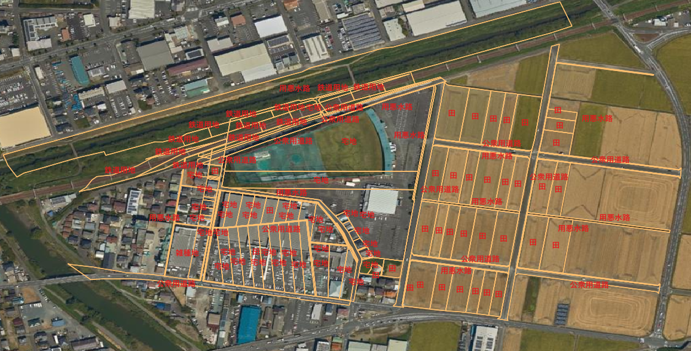

# 🗂️ 自動地目分類器（auto-chimoku-classifier）

このプロジェクトは、ラスタ画像（例：空中写真）と地番図などのG空間情報を用いて、自動的に**地目（ちもく）分類**を行う分類器システムです。地理空間データをもとに、学習済みモデルを用いて分類を行い、分類結果はGeoJSONとして出力されます。

---
## 📸 推定結果のスクリーンショット

以下は、分類器を実行した際のフォルダ構成のスクリーンショットです。



---
## 📁 構成フォルダ

| フォルダ名        | 内容                                                                 |
|------------------|----------------------------------------------------------------------|
| `入力` (`input`) | 入力ファイル（GeoTIFF、GPKG等）                                     |
| `モデル` (`model`)| 学習済みのモデルデータ（`.pth`）や分類マップ。<br>※ 他都市で作成したモデルを使用しています。詳細は下記参照。 |
| `出力` (`output`)| GeoJSON形式などで出力された分類結果                                   |
| `python_src`     | 推定処理を行うPythonコード群                                           |

---

## 🧠 モデル作成と分類マップの見方

### 学習済みモデル（`.pth`）について

- モデルは他の都市の地番情報と空中写真をもとに学習したものであり、再利用しています。
- この分類器では **PyTorch** を利用した推定を行います。

#### モデル作成の一般的な手順

1. 地番図などのポリゴンデータをカテゴリラベルに整備。
2. 空中写真などのラスタ画像と位置を合わせる。
3. 教師あり学習でモデルを作成（分類器 `.pth` を出力）。

> ※ 本リポジトリには学習スクリプトは含まれていませんが、推定は可能です。

---

### 分類マップの見方（例：`label_map.json`）

```json
{
  "0": "田",
  "1": "畑",
  "2": "宅地",
  "3": "山林",
  "4": "雑種地"
}
```

推定された結果ファイル（GeoJSON）に含まれるカテゴリIDはこのマップに基づいています。QGISなどで読み込むことで視覚的に確認できます。

---

## 📦 使用したデータ

### 🗺️ 地番図データ

- **出典元**：磐田市オープンデータ  
- **URL**：[https://www.city.iwata.shizuoka.jp/_res/projects/default_project/_page_/001/002/775/07tibanzu.zip](https://www.city.iwata.shizuoka.jp/_res/projects/default_project/_page_/001/002/775/07tibanzu.zip)

### 🛰️ 空中写真

- **出典元**：国土地理院 標準地図タイル  
- **形式**：XYZ形式のWebタイル（カラー空中写真）  
- **URL**：[https://maps.gsi.go.jp](https://maps.gsi.go.jp)  
- QGIS等でタイルレイヤーとして利用可能（標準提供）

---

## 🚀 実行方法（例）

```bash
# スクリプト起動
start.bat
```

または、直接Pythonスクリプトを実行：

```bash
python python_src/land_use_guess_fixed.py
```

---

## 📌 備考

- `.gpkg` ファイルは大容量のため `.gitignore` で除外するか、必要に応じて `git add -f` を使用してください。
- モデルや推定処理は地域に依存するため、他都市での利用時は注意が必要です。
- 本プロジェクトは研究および私的利用を前提に **プライベート設定** で運用されています。
